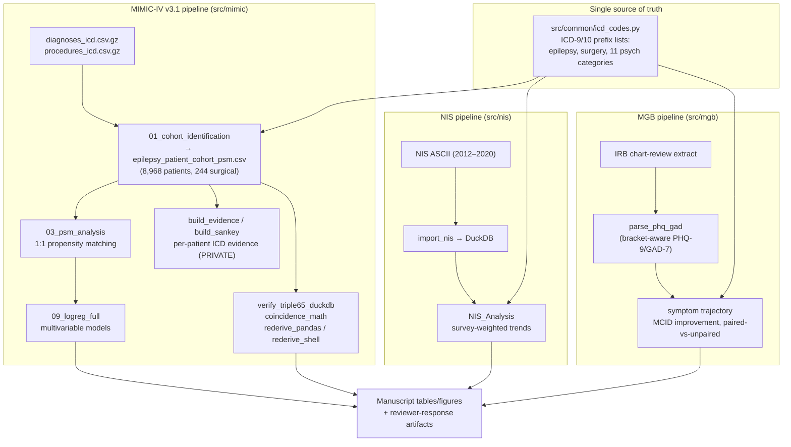

# Architecture

The study runs three independent cohort pipelines that converge on a common set
of psychiatric-comorbidity definitions (`src/common/icd_codes.py`).

## Data flow



## Design principles

- **One source of truth for codes.** Every pipeline imports the same prefix
  lists from `src/common/icd_codes.py`. No cohort redefines a disorder locally.
- **Patient-level data never enters the public repo.** Builders that emit
  per-patient evidence write to paths excluded by `.gitignore`; the public repo
  carries only code and fully aggregated tables.
- **Independent verifiability.** The headline MIMIC result is re-derivable by
  three separate implementations (DuckDB SQL, streaming pandas, shell/awk) that
  share no code — see `docs/TRIPLE65_EXPLAINER.md`.
- **Ascertainment differs by cohort by design.** MIMIC-IV aggregates diagnoses
  across all admissions (cumulative); NIS treats each discharge independently
  (single-encounter); MGB adds chart review and PHQ-9/GAD-7. These differences
  are intrinsic to the data and are surfaced, not hidden, in the results.
```
